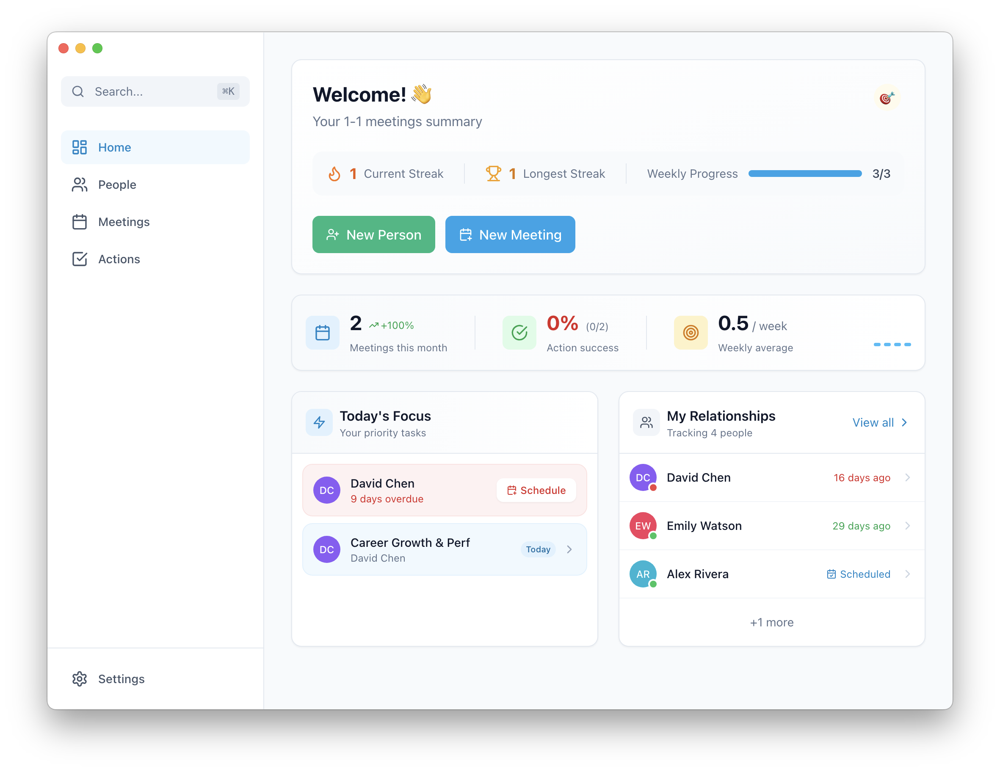

# oikio

A local-first desktop application for managing 1-1 meeting notes with your managers, reports, and teammates.



## Features

- **Person Management** – Keep track of people you have 1-1s with
- **Meeting Notes** – Rich text editor with markdown support
- **Action Items** – Track follow-ups and to-dos from your meetings
- **Templates** – Create reusable meeting templates
- **Dashboard** – Overview of upcoming meetings and pending actions
- **Notifications** - Meeting and action item reminders
- **Data Management** - Export/Import your data (JSON backup)
- **Multi-language** – English and Turkish support
- **Local-first** – All data stays on your machine (JSON file storage), no cloud sync

## Tech Stack

- Electron + React 18
- TypeScript
- Vite
- TailwindCSS + Radix UI
- Framer Motion
- Zustand (state management)
- TipTap (rich text editor)
- i18next (internationalization)

## Getting Started

```bash
# Install dependencies
npm install

# Run in development (concurrently runs Vite and Electron)
npm run electron:dev

# Run just the Vite dev server (web mode)
npm run dev

# Lint code
npm run lint

# Format code
npm run format

# Build for production
npm run build
```

## Structure

- `src/` - React application source code
- `electron/` - Electron main and preload scripts
- `dist-electron/` - Compiled Electron scripts

## License

MIT
