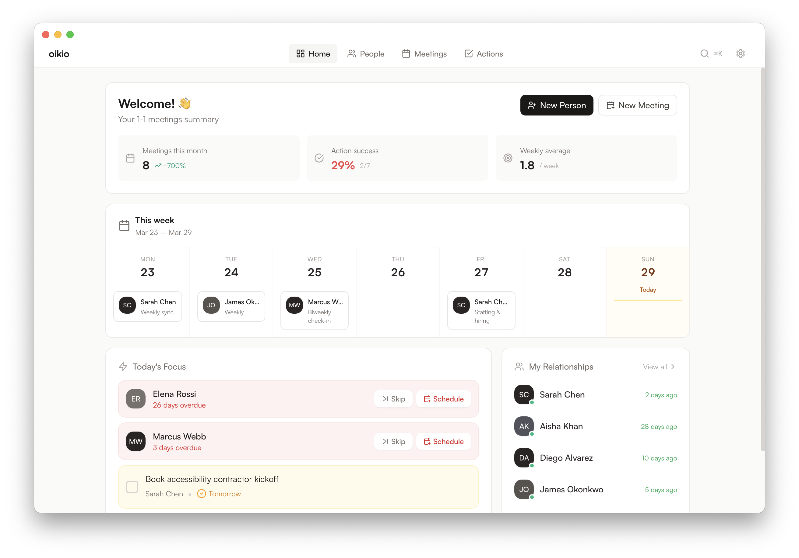

# oikio

[](https://opensource.org/licenses/MIT)
[](https://www.electronjs.org/)
[](https://reactjs.org/)
[](https://www.typescriptlang.org/)

A **local-first** desktop app designed to help you keep track of 1-1 meetings with your managers, teammates, and reports. Stay organized with your notes, actions, and relationships in a secure and fast way.



## Why oikio?

Unlike cloud-based tools, oikio takes a different approach:

- **Privacy:** Your sensitive 1-1 notes never leave your machine.
- **Speed:** Zero lag. Everything happens instantly.
- **Offline:** No internet? No problem. Your notes are always with you.

---

## Key Features

### People management

- List teammates and managers with optional role, title, and goals.
- Meeting frequency goals (weekly through quarterly) and relationship health indicators.
- Quick notes and reusable talking-point prep per person.
- Skip a cycle with a reason when you need to defer a 1-1.
- Export a **Markdown report** for a person over a date range (meetings, notes, talking points, skips).

### Meeting notes

- Rich text editor powered by **TipTap**.
- Templates by category to keep meetings consistent.
- **Focus mode** for distraction-free capture.
- Optional **mood** rating after a meeting.

### Action items

- Capture during or after meetings with ownership (me vs. other), due dates, and tags.
- **Progress notes** on actions for ongoing updates.
- Global actions view and person-level pending actions.

### Dashboard and search

- Today’s focus, relationship grid, and **weekly schedule** overview.
- **Quick create** for the next suggested meeting from a person’s page.
- **Search** across people, meetings, actions, and templates with plain-text snippets.

### Other

- **Local storage:** Single JSON file under Electron’s user data path.
- **Export / import** JSON for backups or moving machines (default templates handled separately).
- **Notifications** for upcoming meetings and due or overdue actions.
- **English and Turkish** UI.
- **Keyboard shortcuts** (search, quick action, new meeting/person, help).

---

## Tech stack

### Frontend and UI

- **React 18** + **Vite 6**
- **TailwindCSS** + **Radix UI**
- **TipTap 3** (rich text)
- **Framer Motion**, **Lucide React**

### Desktop and data

- **Electron 35**
- **Zustand** (state)
- **i18next** (i18n)
- **Zod** (validation)

---

## Getting started

### Prerequisites

- [Node.js](https://nodejs.org/) (v18 or higher)
- [npm](https://www.npmjs.com/)

### Installation

```bash
git clone https://github.com/yourusername/oikio.git
cd oikio
npm install
```

### Development

```bash
npm run electron:dev
npm run dev
npm run lint
npm run format
```

### Build

```bash
npm run build
```

Production artifacts go under `release/` (platform-specific). In CI, `electron-builder` may expect `GH_TOKEN` if publishing to GitHub Releases is enabled.

---

## Project structure

```text
├── electron/          # Main process, IPC, database layer, notifications
├── src/
│   ├── components/    # UI and domain components
│   ├── i18n/          # Locale JSON
│   ├── lib/           # Utilities (relationships, analytics, report Markdown, etc.)
│   ├── pages/         # Routed screens
│   ├── services/      # Renderer API wrappers (IPC)
│   ├── store/         # Zustand stores
│   └── types/         # Shared TypeScript types
├── assets/            # README images
└── public/            # Static assets
```

---

## License

Distributed under the **MIT License**.
